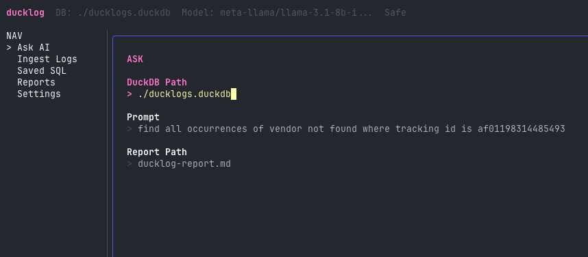
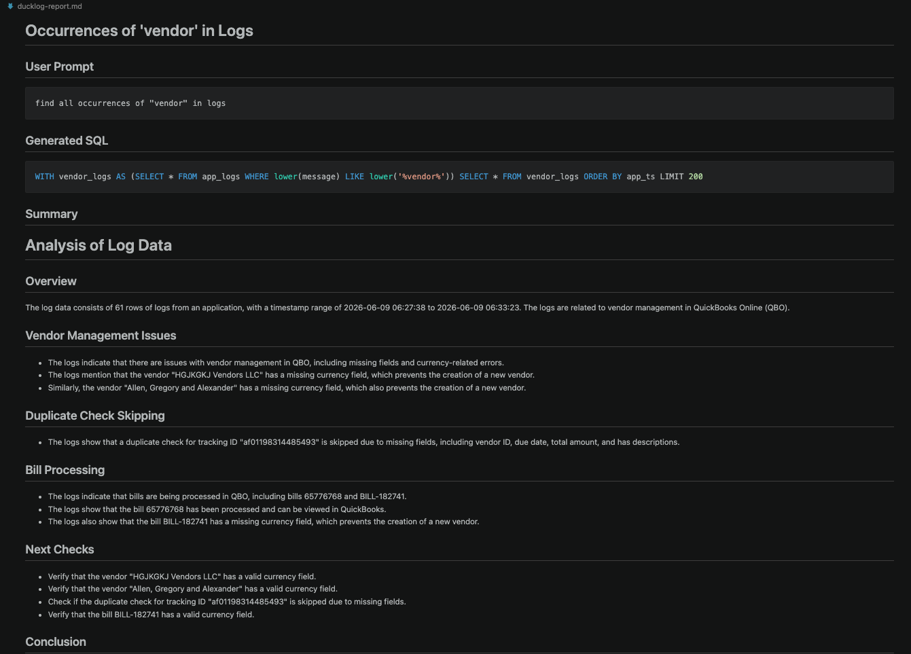

# DuckLogs

DuckLogs is a small terminal tool for investigating CloudWatch application logs.

It can:

- Ingest CloudWatch logs into a local DuckDB database.
- Parse raw log lines into structured columns like `tracking_id`, `realm_id`, `module`, `function_name`, `status`, and `message`.
- Ask natural-language questions about the local DuckDB data.
- Preview the generated SQL before trusting the answer.
- Write Markdown reports with the prompt, SQL, row count, result table, AI summary, and limitations.

<p align="center">
  
  
</p>

## Requirements

- Go 1.26+
- AWS credentials configured for CloudWatch Logs access
- An OpenRouter API key for AI query/report features

## Install

Clone the project, then build the binary:

```bash
go build -o ducklog .
```

Run it:

```bash
./ducklog help
```

For development, you can also use:

```bash
go run . help
```

## Configure

Create a local `.env` file from the example:

```bash
cp .example.env .env
```

Set your OpenRouter key:

```bash
OPENROUTER_API_KEY=sk-or-v1-your-real-key
```

Useful settings:

```bash
OPENROUTER_MODEL=qwen/qwen-2.5-coder-32b-instruct
DUCKLOG_DATABASE=./ducklogs.duckdb
DUCKLOG_REPORT_PATH=ducklog-report.md
```

DuckLogs loads `.env` automatically. Values in `.env` take precedence for this local app.

## Check OpenRouter Credentials

Before using Ask AI, verify the key:

```bash
go run ./scripts/check_openrouter.go
```

Expected success:

```text
OpenRouter credential check passed.
```

## Use The TUI

Start the terminal UI:

```bash
./ducklog tui
```

Or:

```bash
go run . tui
```

The TUI has two main screens:

- `Ask AI`: ask a logs question, generate SQL, run it against DuckDB, and preview the Markdown report.
- `Ingest Logs`: fetch CloudWatch logs into the local DuckDB database.

Keyboard shortcuts:

- `1`: Ask AI screen
- `2`: Ingest Logs screen
- `Tab` / `Shift+Tab`: move between fields
- `Enter` / `Ctrl+S`: run the current action
- `PgUp` / `PgDn`: scroll the rendered report preview
- `Q`: quit

## Ingest Logs

From the TUI, open `Ingest Logs`, then fill:

- `Log Group`: CloudWatch log group name
- `Region`: AWS region
- `DuckDB Path`: local database path
- `Search`: optional CloudWatch filter text
- `Time Window`: values like `5m`, `30m`, `6h`, or `2d`

DuckLogs stores rows in the `app_logs` table.

## Ask Questions

CLI dry run, which only generates and validates SQL:

```bash
./ducklog ask "find all occurrences of vendor not found where tracking id is af01198314485493" --dry-run
```

Run the generated SQL:

```bash
./ducklog ask "find all occurrences of vendor not found where tracking id is af01198314485493" --run
```

Generate a Markdown report:

```bash
./ducklog ask "find all occurrences of vendor not found where tracking id is af01198314485493" --report vendor-not-found.md
```

Use a different database:

```bash
./ducklog ask "show error logs from the last run" --run --db ./ducklogs.duckdb
```

## Safety

Generated SQL is validated before execution.

Allowed query starts:

- `SELECT`
- `WITH`

Blocked keywords include:

- `INSERT`
- `UPDATE`
- `DELETE`
- `DROP`
- `ALTER`
- `CREATE`
- `COPY`
- `INSTALL`
- `LOAD`
- `ATTACH`
- `EXPORT`
- `PRAGMA`
- `CALL`
- `DETACH`

Every report includes the user question, generated SQL, row count, results, AI summary, and limitations so the answer leaves evidence behind.

## Schema

DuckLogs writes parsed logs to:

```sql
app_logs(
  line_no BIGINT,
  cloudwatch_ts TEXT,
  log_stream TEXT,
  app_ts TIMESTAMP,
  level TEXT,
  app_name TEXT,
  process_id TEXT,
  thread_id TEXT,
  tracking_id TEXT,
  realm_id TEXT,
  source_location TEXT,
  module TEXT,
  function_name TEXT,
  line_number INTEGER,
  event_name TEXT,
  status TEXT,
  iteration_count INTEGER,
  message TEXT,
  attrs JSON,
  raw_line TEXT
)
```

## Test

Run the full test suite:

```bash
go test ./...
```
